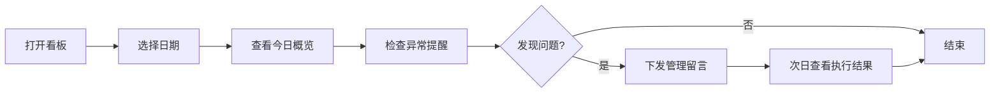

## 1. 产品概述

面向连锁口腔诊所店长的洁牙抛光套餐经营看板，帮助店长在每天开店前和收班后快速掌握套餐经营状况，用少量关键指标管理收费套餐，而非翻阅繁杂流水表。

- **核心用户**：连锁口腔诊所店长、店经理
- **解决问题**：套餐经营数据分散、异常难发现、管理指令难追踪
- **产品价值**：5分钟掌握当日经营，3个模块看透套餐健康度，1条留言落实管理动作

## 2. 核心功能

### 2.1 用户角色

| 角色 | 登录方式 | 核心权限 |
|------|----------|----------|
| 诊所店长 | 工号登录 | 查看所有看板数据、管理异常、下发留言、查看执行结果 |
| 前台/咨询师 | 工号登录 | 查看留言、标记完成状态 |

### 2.2 功能模块

1. **今日概览**：核心经营指标卡片，一键看清今日大盘
2. **套餐结构**：分类展示套餐销量、退款、改约，支持下钻查看医生/咨询师/时段表现
3. **异常提醒**：智能识别真实管理问题，聚焦高退款、低成交、漏收费等
4. **留言管理**：店长下发管理指令，次日追踪执行结果

### 2.3 页面详情

| 页面名称 | 模块名称 | 功能描述 |
|----------|----------|----------|
| 经营看板主页 | 顶部导航栏 | 日期切换、门店切换、用户信息、刷新按钮 |
| 经营看板主页 | 今日概览 | 预约人数、实际到店、套餐成交、客单价、抛光加购率5个核心指标卡片，支持环比/同比 |
| 经营看板主页 | 套餐结构 | 按普通洁牙、喷砂抛光、敏感护理等分类，展示销量、退款、改约，点击可下钻查看详情 |
| 经营看板主页 | 异常提醒 | 问题卡片列表，显示问题类型、严重程度、涉及套餐/时段，点击可查看详情 |
| 套餐详情弹窗 | 医生表现 | 按医生维度展示套餐销量、客单价、退款率 |
| 套餐详情弹窗 | 咨询师表现 | 按咨询师维度展示推荐成功率、加购率 |
| 套餐详情弹窗 | 时段表现 | 按时段维度展示预约量、成交率、到店率 |
| 留言面板 | 留言输入 | 店长输入留言内容、指定执行对象、设定期望完成时间 |
| 留言面板 | 历史留言 | 展示历史留言及执行状态、结果数据 |

## 3. 核心流程

### 3.1 开店前检查流程
店长打开看板 → 查看今日概览 → 检查异常提醒 → 针对问题下发留言 → 开始营业

### 3.2 收班复盘流程
店长打开看板 → 切换到"今日"数据 → 查看套餐结构 → 分析各套餐表现 → 针对问题下发次日指令 → 查看昨日留言执行结果

## 4. 用户界面设计

### 4.1 设计风格

**整体调性**：专业医疗极简风，数据清晰、操作高效

- **主色调**：医疗蓝 `#0D9488`（代表专业、可信赖）
- **辅助色**：橙红 `#F97316`（异常提醒）、绿色 `#22C55E`（正常）、黄色 `#EAB308`（警告）
- **背景色**：浅灰 `#F8FAFC`，卡片纯白 `#FFFFFF`
- **字体**：标题使用 `Noto Sans SC Medium`，数据使用 `Roboto Mono` 等宽字体，正文使用 `Noto Sans SC Regular`
- **卡片风格**：圆角8px，精致阴影，层次分明
- **布局**：三栏栅格布局，顶部导航+主内容区

### 4.2 页面设计概览

| 页面名称 | 模块名称 | UI元素 |
|----------|----------|--------|
| 经营看板主页 | 今日概览 | 5个数据卡片，带趋势箭头和环比数值，悬停微动效，加载时骨架屏 |
| 经营看板主页 | 套餐结构 | 可展开的套餐卡片列表，销量柱状图，退款红色标签，点击展开下钻面板 |
| 经营看板主页 | 异常提醒 | 带优先级标签的问题卡片，红/黄/绿三色标识，点击展开详情 |
| 经营看板主页 | 留言面板 | 悬浮式留言入口，展开后为聊天式界面，区分已完成/待执行 |
| 套餐详情弹窗 | 医生/咨询师/时段 | 三标签切换，表格+迷你图表，数据高亮 |

### 4.3 响应式设计

- **桌面端**（1280px+）：三栏布局，完整展示所有模块
- **平板端**（768px-1279px）：两栏布局，套餐结构与异常提醒堆叠
- **移动端**（<768px）：单列流式布局，折叠面板展开查看

### 4.4 动效设计

- **页面加载**：模块渐入动画，0.3s延迟交错出现
- **数据更新**：数值变化时平滑过渡（数字滚动动画）
- **卡片悬停**：轻微上浮 + 阴影加深
- **面板展开**：高度平滑过渡 + 内容淡入
- **异常提醒**：新增异常时脉冲动画提示
