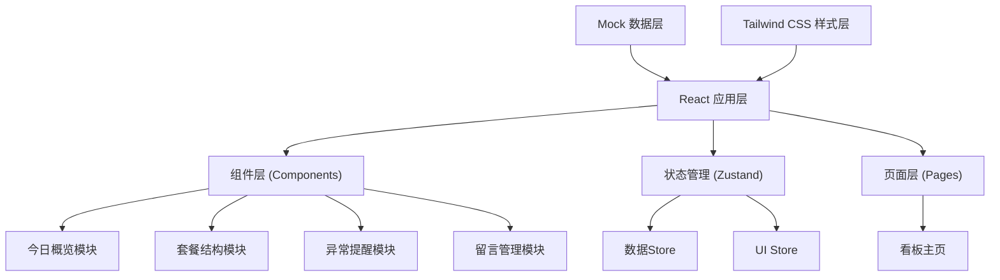

## 1. 架构设计

本项目为纯前端数据看板，采用React + TypeScript + Vite技术栈，使用Mock数据模拟真实业务场景。



## 2. 技术描述

- **前端框架**: React@18 + TypeScript@5
- **构建工具**: Vite@5
- **样式方案**: TailwindCSS@3
- **状态管理**: Zustand@4
- **路由管理**: React Router DOM@6
- **图表库**: Recharts@2 (轻量级React图表库)
- **图标库**: Lucide React
- **数据方案**: 前端Mock数据，模拟真实业务场景
- **字体方案**: Noto Sans SC (中文) + Roboto Mono (数字)

## 3. 项目结构

```
src/
├── components/
│   ├── dashboard/
│   │   ├── OverviewCards.tsx      # 今日概览卡片
│   │   ├── PackageStructure.tsx   # 套餐结构
│   │   ├── AlertsPanel.tsx        # 异常提醒
│   │   └── MessagePanel.tsx       # 留言面板
│   ├── shared/
│   │   ├── Header.tsx             # 顶部导航
│   │   ├── StatCard.tsx           # 数据卡片组件
│   │   ├── Modal.tsx              # 弹窗组件
│   │   ├── Tabs.tsx               # 标签页组件
│   │   └── NumberScroll.tsx       # 数字滚动动画
│   └── modals/
│       └── PackageDetailModal.tsx # 套餐详情弹窗
├── pages/
│   └── Dashboard.tsx              # 看板主页
├── store/
│   ├── useDashboardStore.ts       # 看板数据状态
│   └── useUIStore.ts              # UI交互状态
├── data/
│   └── mockData.ts                # Mock业务数据
├── types/
│   └── index.ts                   # TypeScript类型定义
├── utils/
│   ├── formatters.ts              # 格式化工具
│   └── anomalyDetector.ts         # 异常检测算法
├── hooks/
│   └── useAnimatedNumber.ts       # 数字动画Hook
├── App.tsx
├── main.tsx
└── index.css
```

## 4. 路由定义

| 路由 | 页面 | 说明 |
|------|------|------|
| / | Dashboard | 经营看板主页，包含所有模块 |

## 5. 数据模型

### 5.1 数据类型定义

```typescript
// 核心指标
interface OverviewStats {
  appointmentCount: number;
  actualArrival: number;
  packageDeals: number;
  avgOrderValue: number;
  polishAddRate: number;
  comparedYesterday: {
    appointmentCount: number;
    actualArrival: number;
    packageDeals: number;
    avgOrderValue: number;
    polishAddRate: number;
  };
}

// 套餐分类
interface PackageCategory {
  id: string;
  name: string;
  type: 'basic' | 'polish' | 'sensitive' | 'special';
  sales: number;
  refunds: number;
  reschedules: number;
  revenue: number;
  targetSales: number;
}

// 套餐详情
interface PackageDetail {
  packageId: string;
  doctors: DoctorPerformance[];
  consultants: ConsultantPerformance[];
  timeSlots: TimeSlotPerformance[];
}

// 医生表现
interface DoctorPerformance {
  id: string;
  name: string;
  sales: number;
  avgPrice: number;
  refundRate: number;
}

// 咨询师表现
interface ConsultantPerformance {
  id: string;
  name: string;
  recommendationRate: number;
  addOnRate: number;
  dealCount: number;
}

// 时段表现
interface TimeSlotPerformance {
  time: string;
  appointments: number;
  dealRate: number;
  arrivalRate: number;
}

// 异常提醒
interface AnomalyAlert {
  id: string;
  type: 'high_refund' | 'low_conversion' | 'missed_charge' | 'low_addon';
  severity: 'critical' | 'warning' | 'info';
  title: string;
  description: string;
  relatedPackage?: string;
  relatedTimeSlot?: string;
  relatedDoctor?: string;
  suggestedAction?: string;
  detectedAt: string;
}

// 店长留言
interface ManagerMessage {
  id: string;
  content: string;
  targetRole: 'reception' | 'consultant' | 'all';
  createdAt: string;
  expectedDate: string;
  status: 'pending' | 'completed';
  result?: {
    executedAt: string;
    metrics: {
      name: string;
      before: number;
      after: number;
    }[];
    notes: string;
  };
}
```

### 5.2 异常检测算法

```typescript
// 退款率异常: 超过15%标记为警告，超过25%标记为严重
const REFUND_WARNING_THRESHOLD = 0.15;
const REFUND_CRITICAL_THRESHOLD = 0.25;

// 成交率异常: 预约满但成交率低于60%
const LOW_CONVERSION_THRESHOLD = 0.60;

// 漏收费检测: 洁牙完成但无抛光收费记录，且客户符合条件
const POLISH_MISS_RATE = 0.30;

// 加购率异常: 低于平均水平50%
const LOW_ADDON_RATIO = 0.50;
```

## 6. 状态管理

### 6.1 Dashboard Store

```typescript
const useDashboardStore = create((set) => ({
  currentDate: new Date(),
  selectedClinic: '总店',
  overviewStats: null,
  packages: [],
  selectedPackage: null,
  packageDetail: null,
  alerts: [],
  messages: [],
  loading: false,
  
  setCurrentDate: (date) => set({ currentDate: date }),
  fetchOverview: () => { /* 加载概览数据 */ },
  fetchPackages: () => { /* 加载套餐数据 */ },
  selectPackage: (pkg) => { /* 选择套餐，加载详情 */ },
  dismissAlert: (id) => { /* 忽略异常 */ },
  sendMessage: (msg) => { /* 发送留言 */ },
}));
```

### 6.2 UI Store

```typescript
const useUIStore = create((set) => ({
  showMessagePanel: false,
  showPackageModal: false,
  activeTab: 'doctors',
  
  toggleMessagePanel: () => set((s) => ({ showMessagePanel: !s.showMessagePanel })),
  openPackageModal: () => set({ showPackageModal: true }),
  closePackageModal: () => set({ showPackageModal: false }),
  setActiveTab: (tab) => set({ activeTab: tab }),
}));
```

## 7. 核心组件规范

| 组件 | 职责 | 交互 |
|------|------|------|
| OverviewCards | 展示5个核心KPI，含环比趋势 | 悬停显示详情，点击可切换周/月视图 |
| PackageStructure | 套餐分类展示，销量柱状图 | 点击套餐行展开详情，点击"查看详情"打开弹窗 |
| AlertsPanel | 异常提醒列表，按严重程度排序 | 点击卡片展开详情，显示建议操作 |
| MessagePanel | 留言输入、历史留言、执行结果 | 展开/收起动画，点击历史留言查看执行数据 |
| PackageDetailModal | 套餐下钻详情，三标签切换 | 医生/咨询师/时段表现数据切换 |

## 8. 性能优化

- 使用React.memo优化列表项渲染
- 图表数据按需加载
- 数字滚动动画使用requestAnimationFrame
- 状态更新批量处理
- 组件懒加载（非关键路径）
